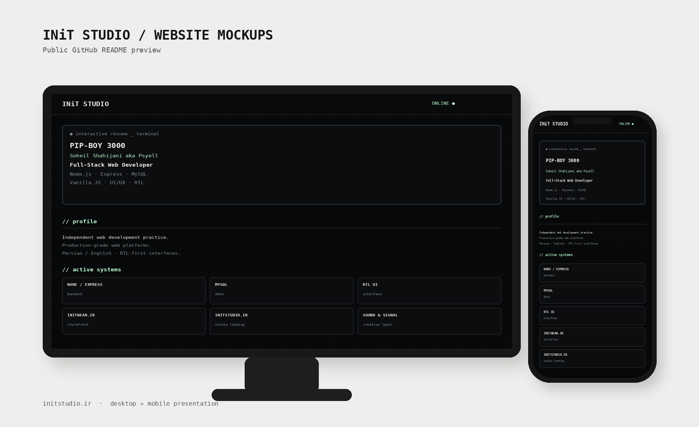
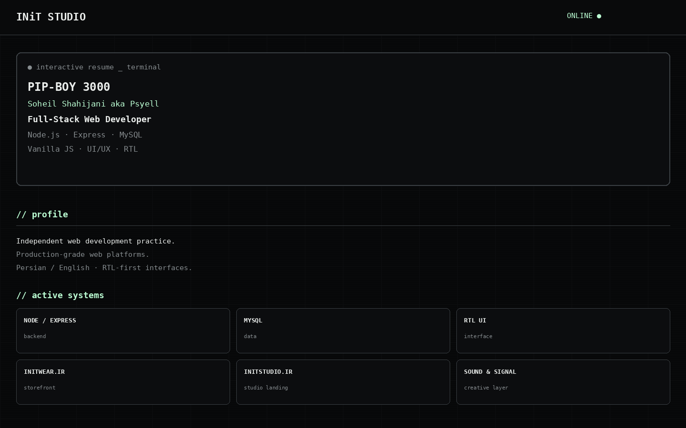
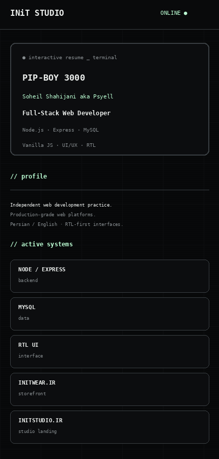

<div align="center">

# INiT Studio

### Production-Grade Web Platforms
**Full-Stack Development · UI/UX · RTL / Persian Interfaces**

[](https://initstudio.ir)


</div>

---

## Preview

<div align="center">
  <a href="https://initstudio.ir">
    
  </a>
</div>

---

## About

**INiT Studio** is an independent web development practice focused on creating lightweight, production-ready digital platforms with a strong visual identity.

The website presents the studio through a dark, terminal-inspired interface and combines full-stack development, UI/UX, RTL support and selected digital work in a single responsive experience.

## Stack

- **Backend:** Node.js, Express.js
- **Database:** MySQL
- **Frontend:** HTML5, CSS3, Vanilla JavaScript
- **Interface:** Responsive UI, RTL / Persian support
- **Focus:** Performance, maintainability and custom interaction design

## Website Highlights

- Terminal / system-inspired visual identity
- Fully responsive desktop and mobile layouts
- Persian / English friendly interface
- Lightweight vanilla frontend
- Interactive profile and project sections
- Custom UI instead of template-based components

## More Screens

<table>
  <tr>
    <td width="70%">
      
    </td>
    <td width="30%">
      
    </td>
  </tr>
</table>

## Live Website

**[initstudio.ir →](https://initstudio.ir)**

## Local Development

```bash
git clone <YOUR_REPOSITORY_URL>
cd <YOUR_PROJECT_FOLDER>
npm install
npm run dev
```

Create your local environment file from the example provided in the repository:

```bash
cp .env.example .env
```

> Never commit real credentials, API keys or production environment values to a public repository.

## Public Repository Notes

This README intentionally documents the project at a high level. Production credentials, private configuration, internal secrets and environment-specific values should remain outside the repository.

---

<div align="center">

**INiT Studio**  
`NODE.JS` · `EXPRESS` · `MYSQL` · `VANILLA JS` · `RTL` · `UI/UX`

[Visit Website](https://initstudio.ir)

</div>
