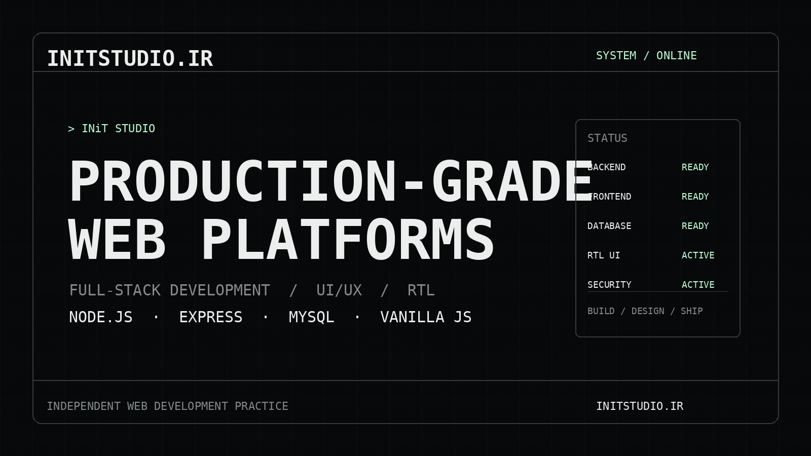

<div align="center">

# INiT Studio

### Production‑Grade Web Platforms
**Full‑Stack Development · UI/UX · RTL / Persian Interfaces**

[](https://initstudio.ir)
[](#tech-stack)
[](#tech-stack)
[](#tech-stack)
[](#tech-stack)

</div>

---

## Preview

<div align="center">

<a href="https://initstudio.ir">
  
</a>

**[Visit the live website →](https://initstudio.ir)**

</div>

---

## About

**INiT Studio** is an independent web development practice focused on building lightweight, production‑grade digital platforms with a strong visual identity.

The website combines a **dark retro‑futuristic / terminal‑inspired interface** with a full‑stack engineering profile, presenting development capabilities, infrastructure practices, selected projects, and creative interests in one interactive experience.

The project places special emphasis on:

- Production‑ready full‑stack architecture
- Lightweight frontend development
- RTL and Persian‑language interfaces
- Performance and maintainability
- Authentication and application security
- Strong visual identity and custom UI/UX

---

## Tech Stack

### Backend

- **Node.js**
- **Express.js**
- **MySQL**

### Frontend

- **HTML5**
- **CSS3**
- **Vanilla JavaScript**
- Custom responsive UI
- RTL / Persian UI support

### Security & Infrastructure

- JWT‑based authentication
- Refresh token workflow
- Role‑based access control
- Rate limiting
- Secure HTTP headers
- CORS / CSP / HSTS
- Input validation and sanitization
- Cache‑control strategies
- Dynamic TTL / jitter techniques

---

## Highlights

```text
> FULL‑STACK WEB
> PRODUCTION‑GRADE PLATFORMS
> NODE · EXPRESS · MYSQL
> VANILLA FRONTEND
> RTL · PERSIAN UI
> SECURITY · PERFORMANCE · INFRASTRUCTURE
```

The experience is designed around a distinctive terminal / system‑interface aesthetic while keeping the actual web stack minimal and maintainable.

---

## Featured Sections

| Section | Description |
|---|---|
| **Interactive Resume** | Terminal‑style introduction to the developer and studio |
| **Profile** | Background, approach and development philosophy |
| **Security & Infra** | Security, caching and production infrastructure practices |
| **Active Projects** | Selected live web projects |
| **Sound & Signal** | Creative influences including electronic music and sound design |
| **Contact** | Social and professional contact information |

---

## Design Direction

The visual system of INiT Studio is built around:

- Dark monochrome surfaces
- Terminal / command‑line typography
- Retro‑futuristic system interfaces
- Minimal but information‑dense layouts
- Technical labels, system states and status indicators
- Responsive desktop and mobile presentation

---

## Project Philosophy

> Build fast.  
> Keep it lightweight.  
> Secure the production layer.  
> Design interfaces with identity.

INiT Studio focuses on solutions that balance **engineering quality**, **performance**, and **visual communication** rather than relying on unnecessary frontend complexity.

---

## Live Project

### INiT Studio

**Website:** [https://initstudio.ir](https://initstudio.ir)

The studio's digital identity and interactive full‑stack portfolio.

---

## Local Development

Clone the repository:

```bash
git clone <YOUR_REPOSITORY_URL>
cd <YOUR_PROJECT_FOLDER>
```

Install dependencies:

```bash
npm install
```

Create the environment configuration required by the project:

```bash
cp .env.example .env
```

Then run the start or development script configured in `package.json`, for example:

```bash
npm run dev
```

> The exact environment variables and start command should follow the configuration of this repository.

---

## Repository Asset

The README preview is stored locally at:

```text
docs/preview.png
```

This means the GitHub preview is **static** and does not depend on an external screenshot service.

---

## Contact

**INiT Studio**  
Full‑Stack Web Development · Production‑Grade Platforms

- Website: [initstudio.ir](https://initstudio.ir)
- LinkedIn: [Soheil Shahijani](https://www.linkedin.com/in/soheilshahijani/)

---

<div align="center">

### INiT Studio

`NODE.JS` · `EXPRESS` · `MYSQL` · `VANILLA JS` · `RTL` · `UI/UX`

**Designed & developed with a focus on performance, security and identity.**

</div>
